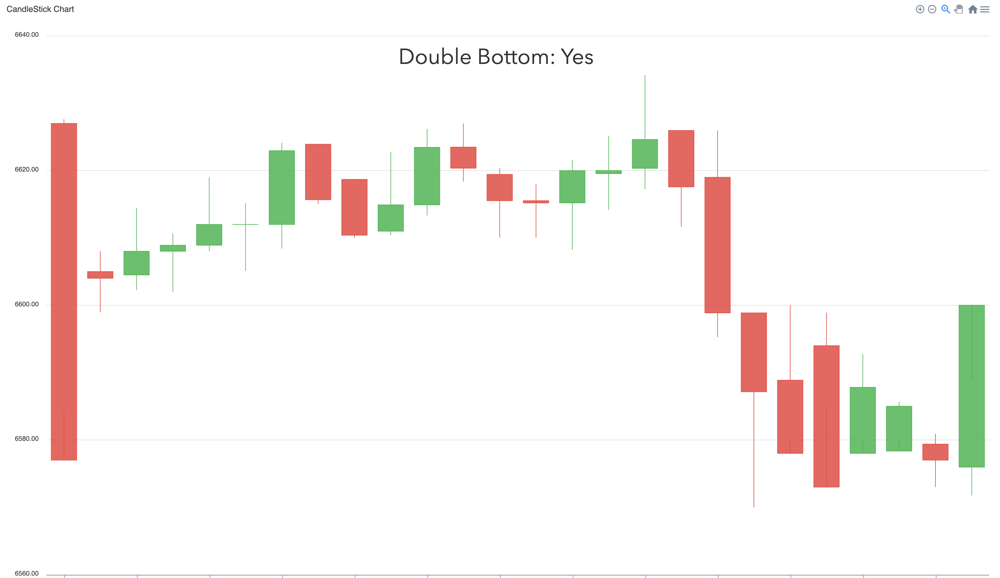
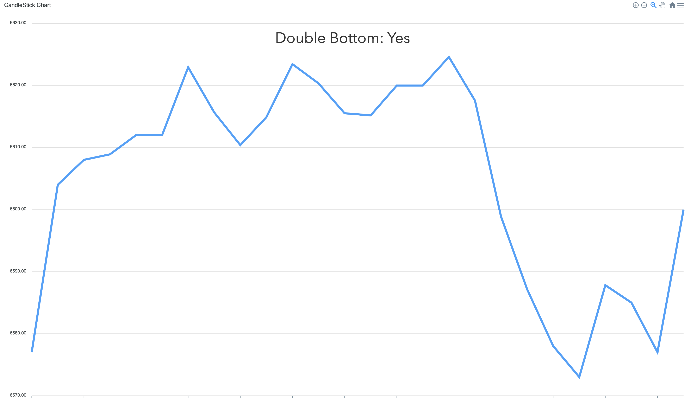
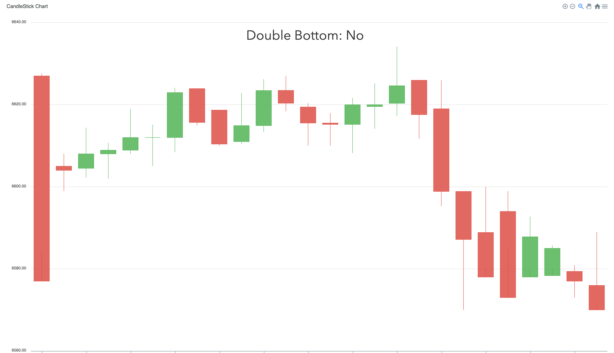
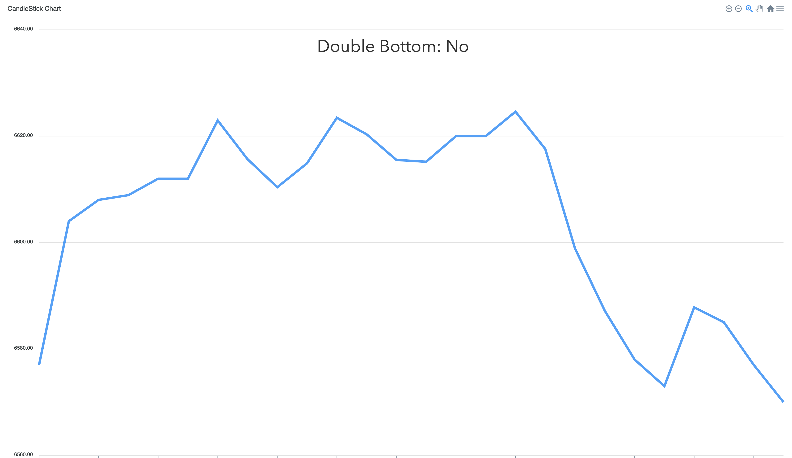
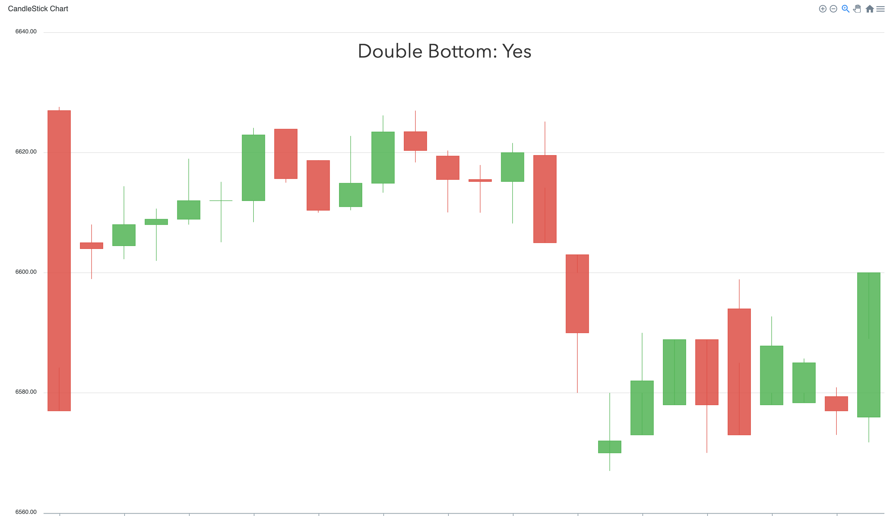
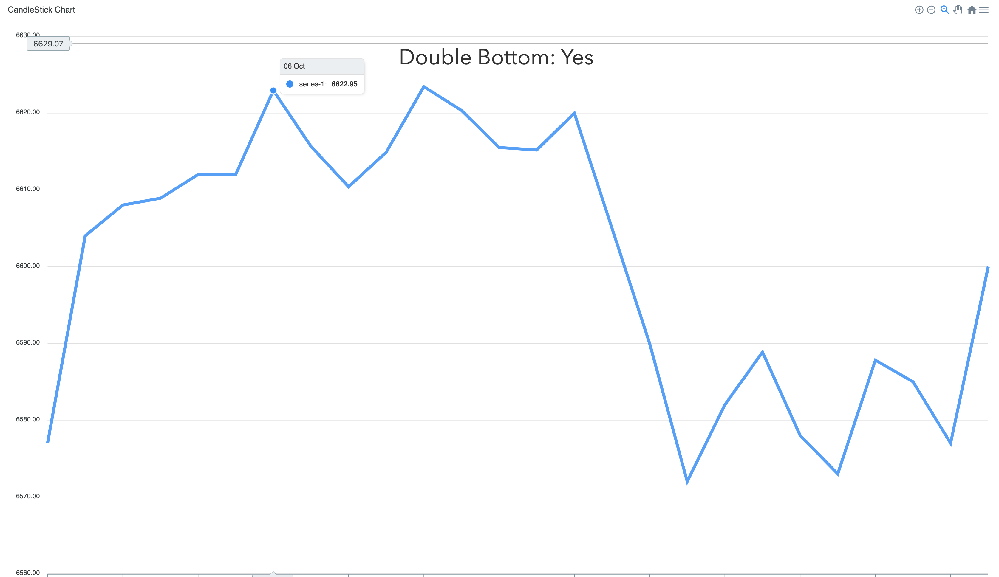

# Find Double Bottoms
## Super basic for now
### Can adjust to length of range!

#### Double bottom with range of 5 points (candlestick)

#### Double bottom with range of 5 points (line)

#### No double bottom with range of 5 points (candlestick)

#### No double bottom with range of 5 points (line)

#### Double bottom with range of 9 points (candlestick)

#### Double bottom with range of 9 points (line)

